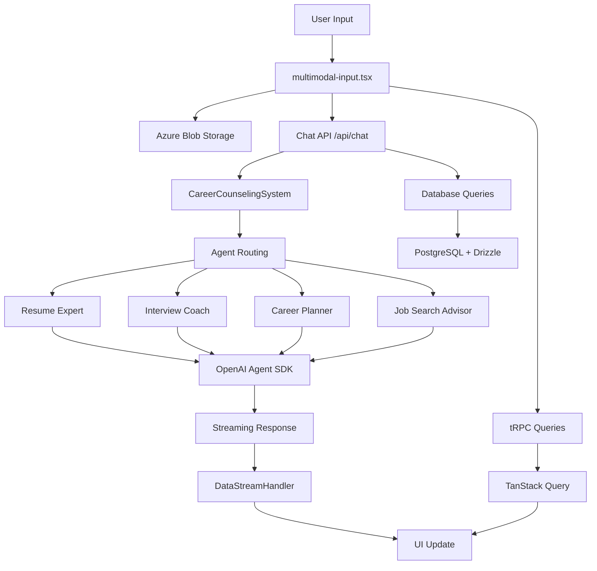

# Career Counseling System - Codebase Workflow Analysis

## Executive Summary

This document provides a comprehensive analysis of the career counseling chat application codebase, identifying **what we use**, **what we don't use**, and documenting the complete workflow from UI to backend. The system is built with Next.js 15, TypeScript, OpenAI Agent SDK, and a multi-agent career counseling architecture.

## System Architecture Overview

### Tech Stack (Active Components)
- **Frontend**: Next.js 15 App Router, TypeScript, React 18
- **Backend**: Next.js API routes + tRPC v11 for type-safe APIs
- **Database**: PostgreSQL with Drizzle ORM
- **Authentication**: NextAuth.js v5 (beta)
- **AI**: OpenAI Agent SDK + Vercel AI SDK for streaming
- **File Storage**: Azure Blob Storage 
- **UI**: Tailwind CSS + shadcn/ui components
- **Data Fetching**: TanStack Query via tRPC

## Complete Workflow: UI to Backend

### 1. Application Entry Points

#### **USED - Core Entry Files**
- `app/layout.tsx` - Root layout with providers (ThemeProvider, SessionProvider, TRPCReactProvider)
- `app/(chat)/layout.tsx` - Chat layout with sidebar and DataStreamProvider
- `app/(chat)/page.tsx` - Main chat page entry point

#### **Authentication Flow**
- `app/(auth)/auth.ts` - NextAuth configuration with guest user support
- Authentication happens at page load, redirects to `/api/auth/guest` if not authenticated

### 2. Main UI Components (USED)

#### **Primary Chat Interface**
```typescript
Chat Component Flow:
app/(chat)/page.tsx 
  → components/chat.tsx (main chat container)
    → components/messages.tsx (message display)
      → components/message.tsx (individual messages)
    → components/multimodal-input.tsx (input with file upload)
    → components/artifact.tsx (document sidebar)
```

#### **Key Active Components**
- `components/chat.tsx` - Main chat container with useChat hook
- `components/messages.tsx` - Message display with streaming
- `components/multimodal-input.tsx` - User input with file upload, voice recording
- `components/app-sidebar.tsx` - Navigation sidebar
- `components/agent-handoff-banner.tsx` - Agent transition UI
- `components/agent-indicator.tsx` - Current agent display
- `components/data-stream-handler.tsx` - Streaming data processor

#### **File Upload System**
- Azure Blob Storage integration for PDF, Word, image files
- File analysis with OpenAI vision/document capabilities
- Resume review and document analysis

### 3. Backend API Flow

#### **Main Chat API Route: `app/(chat)/api/chat/route.ts`**
```typescript
Complete Chat Flow:
1. Request validation → postRequestBodySchema.parse()
2. Authentication → auth() session check
3. Rate limiting → getMessageCountByUserId()
4. Chat persistence → saveChat() / getChatById()
5. Message storage → saveMessages()
6. **CAREER COUNSELING SYSTEM INITIALIZATION**
7. File detection and routing
8. Agent-based response streaming
```

#### **Career Counseling Agent System**
```typescript
Agent Workflow:
CareerCounselingSystem (lib/agents/career-counseling-system.ts)
  → handleConversation()
    → Triage agent determines routing
    → Routes to specialist:
      - Resume Expert (resume analysis, ATS optimization)
      - Interview Coach (interview prep, practice questions)  
      - Career Planning Specialist (career transitions)
      - Job Search Advisor (job search strategies)
  → Returns streaming response with handoff suggestions
```

### 4. tRPC API Structure (USED)

#### **Active tRPC Routers** (`lib/trpc/routers/`)
- `_app.ts` - Main router configuration
- `chat.ts` - Chat operations (create, get, update)
- `history.ts` - Chat history with pagination
- `vote.ts` - Message voting system  
- `document.ts` - Document/artifact operations
- `suggestions.ts` - Document suggestions
- `upload.ts` - File upload handling
- `agents.ts` - Agent routing and handoff management

#### **Database Layer** (`lib/db/`)
- `schema.ts` - PostgreSQL schema with Drizzle
- `queries.ts` - Database operations
- Active tables: User, Chat, Message_v2, Vote_v2, Document, ConversationMemory

### 5. AI Integration

#### **OpenAI Agent SDK Integration**
- Multi-agent architecture with specialized career counselors
- Tool-based function calling (file analysis, weather, document creation)
- Streaming responses with agent handoff capabilities
- File analysis for PDFs, images, Word documents

#### **Active AI Tools** (`lib/ai/tools/openai-agents-tools.ts`)
- `getWeatherTool` - Weather information
- `createDocumentTool` - Document creation
- `updateDocumentTool` - Document editing
- `careerCounselingTool` - Agent routing
- `createFileAnalysisTool` - File/resume analysis

### 6. Hooks and State Management (USED)

#### **Active Hooks**
- `hooks/use-agent-handoffs.ts` - Agent transition management
- `hooks/use-chat-visibility.ts` - Chat privacy settings
- `hooks/use-auto-resume.ts` - Session resumption
- `hooks/use-messages.tsx` - Message display logic
- `hooks/use-whisper-recording.ts` - Voice input (Whisper integration)
- `hooks/use-artifact.ts` - Document sidebar state

## UNUSED / DEPRECATED Components

### Legacy Components (NOT USED)
- `components/weather.tsx` - Weather widget (replaced by tool)
- `components/console.tsx` - Debug console (development only)
- `components/diffview.tsx` - Code diff viewer (unused feature)
- `components/sheet-editor.tsx` - Spreadsheet editor (unused)
- `components/image-editor.tsx` - Image editing (unused)

### Deprecated Database Schema
- `Message` table (replaced by `Message_v2`)
- `Vote` table (replaced by `Vote_v2`)
- Legacy migration helpers in `lib/db/helpers/`

### Unused Hooks
- `hooks/use-performance-optimizations.ts` - Client-side optimizations (not actively used)
- `hooks/use-chat-history-infinite.ts` - Infinite scroll (basic pagination used instead)
- `hooks/use-speech-to-text.ts` - Alternative voice implementation (Whisper used)

### Development/Testing Files (NOT PRODUCTION)
- `test-agents.js` - Agent testing script
- `examples/` - Integration examples
- `*.backup` files - Backup copies
- `tsconfig.tsbuildinfo` - TypeScript build cache

## Data Flow Summary



## Key Architectural Decisions

### **What Works Well**
1. **Multi-Agent Architecture** - Clean separation of career counseling specializations
2. **Type Safety** - tRPC + TypeScript provides end-to-end type safety
3. **File Processing** - Robust file upload and analysis system
4. **Streaming** - Real-time response streaming with agent handoffs
5. **Database Design** - Modern Message_v2 structure with parts array

### **Areas of Technical Debt**
1. **Legacy Tables** - Old Message/Vote tables still exist but unused
2. **Unused Components** - Several UI components built but not integrated
3. **Development Files** - Test/example files mixed with production code
4. **Documentation** - Multiple README/guide files need consolidation

## File Classification

### **Core Production Files (KEEP)**
- All `app/(chat)/` routes and layouts
- `components/chat.tsx`, `messages.tsx`, `multimodal-input.tsx`
- `lib/agents/career-counseling-system.ts`
- `lib/trpc/routers/*` (all routers)
- `lib/db/schema.ts`, `queries.ts`
- `hooks/use-agent-handoffs.ts`, `use-whisper-recording.ts`

### **Safe to Remove**
- `components/weather.tsx`, `console.tsx`, `diffview.tsx`
- `hooks/use-speech-to-text.ts`, `use-performance-optimizations.ts`
- `examples/`, `test-agents.js`
- `*.backup` files
- Legacy database helper files

### **Requires Migration**  
- Legacy Message/Vote table cleanup after full migration verification
- Consolidate documentation files
- Move development scripts to separate dev folder

## Recommendations

1. **Clean up legacy code** - Remove unused components and deprecated database tables
2. **Consolidate documentation** - Merge README files and guides
3. **Separate dev files** - Move test/example files to dedicated development folder
4. **Performance audit** - Remove unused hooks and optimize bundle size
5. **Database migration** - Complete transition from legacy tables
6. **Component audit** - Remove or integrate unused UI components

---

## Conclusion

The codebase represents a well-architected career counseling system with a clean multi-agent architecture. The main workflow from user input through agent routing to streaming responses is robust and production-ready. However, there are opportunities for cleanup by removing legacy components and consolidating development files.

**Primary Active Flow**: `Chat UI → API Route → CareerCounselingSystem → OpenAI Agents → Streaming Response → UI Update`

**Core Strength**: Type-safe, streaming, multi-agent career counseling with file processing capabilities.